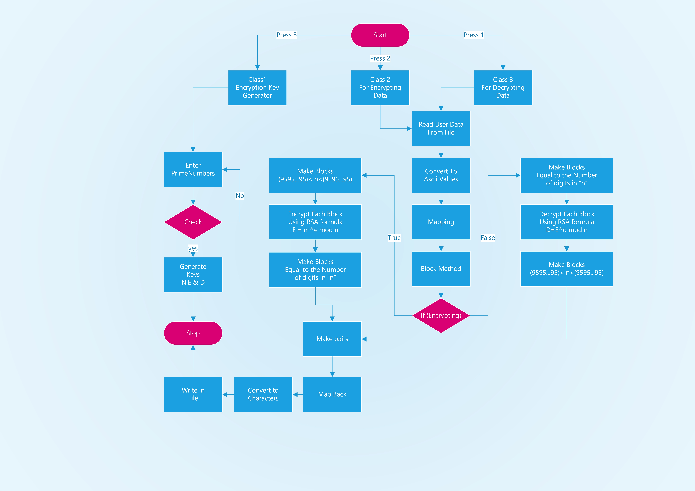

# RSA-Encryption Algorithm

## Introduction

Public key cryptography, also known as asymmetric cryptography, uses two different but mathematically linked keys:

- Public
- Private.

The public key can be shared with everyone, whereas the private key must be kept secret.

In _RSA cryptography_ , both the public and the private keys can encrypt a message; the opposite key from the one used to encrypt a message is used to decrypt it. This attribute is one reason why RSA has become the most widely used asymmetric algorithm: It provides a method to assure the confidentiality, integrity, authenticity, and non-repudiation of electronic communications and data storage.

This was My 3rd Semester Project. I hope this project guides the user and helps him/her advance even further with modifications in this brilliant (up till now) program. This is the sort of technology that is being used almost everywhere nowadays from whatsapp to army intelligence. With a few modifications this code can be used to rule the world.

# Key Generation Algorithm

## Election of Prime Numbers

Generate two large random primes, p and q,
e.g.

```cs
Console.WriteLine("127, 131, 137, 139, 149, 151, 157, 163, 167, 173, 179, 181, 191, 193, 197, 199, etc... \n 1009 1013 1019 1021 1031 1033 1039 1049 1051 1061 1063 1069 1087 1091 1093 1097 1103 1109 1117 1123 1129 \n 9803 9811 9817 9829 9833 9839 9851 9857 9859 9871 9883 9887 9901 9907 9923 9931 9941 9949 ");
```

Checks if the input number is a prime number

```cs
bool PrimeChecker(uint a)
{
    bool isPrime = true;
    for (int i = 2; i <= a / 2; ++i)
    {
        if (a % i == 0)
        {
            isPrime = false;
            break;
        }
    }
    if (isPrime)
        return (true);
    else
        return (false);
}
```

## Calculate Modulus Choose and ϕ

```cs
n = p * q;
Console.WriteLine("n = " + n);
fin = (p - 1) * (q - 1);
Console.WriteLine("fin = " + fin);
```

## Pick Encryption Key

an integer e, 1 < e < ϕ, such that gcd(e,ϕ) = 1

```cs
void CoPrime(ulong ekey, ulong fiN)
{
    for (ekey = 0; ekey < fiN; ekey++)
    {
        bool isCoPrime = true;
        for (uint i = 2; i < fiN; i++)
        {
            if ((fiN % i == 0 || i % fiN == 0) && (ekey % i == 0 || i % ekey == 0) && ekey != i)
            {
                //Console.WriteLine(i);
                isCoPrime = false;
                break;
            }
        }
        if (isCoPrime)
        {
            //Console.WriteLine(fiN + " and " + ekey + " are co primes");
            e = ekey;
            break;
        }
    }
}
```

## Choose Decryption Key

an integer d, 1 < d < ϕ such that, (e\*d)mod ϕ =1

```cs
for (uint i = 0; i < fin * fin; i++)
{
    if ((i * e) % fin == 1)
    {
        d = i;
        Console.WriteLine("d = " + d);
        break;
    }
}
```

## Flow Chart



# ASCII Table

| Character | Decimal | Character | Decimal | Character | Decimal | Character | Decimal |
| :-------: | :-----: | :-------: | :-----: | :-------: | :-----: | :-------: | :-----: |
|   Space   |   32    |     4     |   52    |     H     |   72    |    \      |   92    |
|     !     |   33    |     5     |   53    |     I     |   73    |     ]     |   93    |
|     ”     |   34    |     6     |   54    |     J     |   74    |
|     #     |   35    |     7     |   55    |     K     |   75    |
|    \$     |   36    |     8     |   56    |     L     |   76    |
|     %     |   37    |     9     |   57    |     M     |   77    |
|     &     |   38    |     :     |   58    |     N     |   78    |
|     ’     |   39    |     ;     |   59    |     O     |   79    |
|     (     |   40    |     <     |   60    |     P     |   80    |
|     )     |   41    |     =     |   61    |     Q     |   81    |
|     ∗     |   42    |     >     |   62    |     R     |   82    |
|     +     |   43    |     ?     |   63    |     S     |   83    |
|     ,     |   44    |     @     |   64    |     T     |   84    |
|     -     |   45    |     A     |   65    |     U     |   85    |
|     .     |   46    |     B     |   66    |     V     |   86    |
|     /     |   47    |     C     |   67    |     W     |   87    |
|     0     |   48    |     D     |   68    |     X     |   88    |
|     1     |   49    |     E     |   69    |     Y     |   89    |
|     2     |   50    |     F     |   70    |     Z     |   90    |
|     3     |   51    |     G     |   71    |     [     |   91    |

# [DLL](READMEdocs/SSoS_HS.dll)

- namespace: SSoS_HS
- classes : Encryptor , DataEncrypt

# Contribution

Pull requests are welcome. For major changes, please open an issue first to discuss what you would like to change.

# Issues

If anyone is looking to make some contribution, then following are the issues that you can solve.

- Grammar check | Spelling mistakes
- Code optimization

# License

[LGPL-3.0](/LICENSE)

# Acknowledgments

Discrete Mathematics and Its Applications by Kenneth H. Rosen
